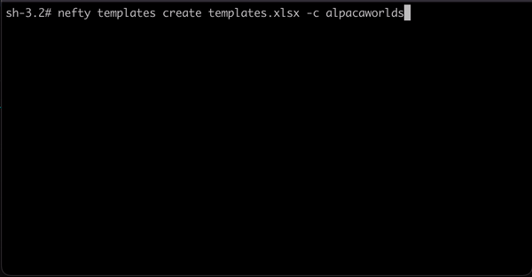

NeftyBlocks CLI
=================

The NeftyBlocks CLI is a tool that will help you manage your collections by creating templates and minting assests.

[](https://oclif.io)
[](https://github.com/oclif/hello-world/blob/main/LICENSE)




<!-- toc -->
* [Requirements](#requirements)
* [Installation](#installation)
* [Configuration](#configuration)
* [Quick Start](#quick-start)
  * [Create templates](#create-templates)
  * [Mint assets](#mint-assets)
  * [Generate PFPs](#generate-pfps)
  * [Transfer tokens](#transfer-tokens)
* [XLS files](#xls-files)
* [Commands](#commands)
<!-- tocstop -->

<!-- requirements -->
# Requirements  

The CLI asks for the following minimum requirements installed:

-  Node.js [v18.x](https://nodejs.org/download/release/latest-v18.x/)  (A little Installation [guide](https://nodejs.dev/en/learn/how-to-install-nodejs/))

<!-- requirementsstop -->

<!-- installation -->
# Installation

To install the CLI you can run the following command:

```
npm install -g @nefty/cli
```

This will download and install the CLI, after its installed you can quickly start by [configuring](#nefty-config-init) your CLI settings

<!-- installationstop -->

<!-- usage -->
```sh-session
$ npm install -g @nefty/cli
$ nefty COMMAND
running command...
$ nefty (--version)
@nefty/cli/0.2.0 darwin-arm64 node-v18.12.1
$ nefty --help [COMMAND]
USAGE
  $ nefty COMMAND
...
```
<!-- usagestop -->

<!-- initialize -->
# Configuration
Neftyblocks-CLI works based on a configuration file that you will need to generate first. 
This file contains the urls and defined values to be able to communicate with the Chain.
In order to generate this configuration you will need to run the following command:

```
nefty config init
```

Then you will be prompt/asked to enter the required information. 
<!-- initializestop -->

<!-- configfile -->

## Configuration file
The neftyblocks-cli requires a configuration that will include all the properties with the information to connect to the proper endpoints.  
You can locate the configuration directory in 

Unix: ~/.config/nefty/config.json
Windows: %LOCALAPPDATA%\nefty\config.json

The required properties are as follows:  


| Property      | Description                                       | Example value |
| --------      | -----------                                       | ------- |
| rpcUrl        | Url that points to your preferred eos node api    | https://wax-testnet.neftyblocks.com |
| aaUrl         | Url that points to your preferred atomic assets api      | https://aa-testnet.neftyblocks.com  |
| explorerUrl   | Url that points to your preferred blocks explorer | https://wax-test.bloks.io  | 
| chainId       | The chain id of the blockchain to interact with   | 1064487b3cd1a897ce03ae5b6a865651747e2e152090f99c1d19d44e01aea5a4 |
| sessionDir    | Directory where the session information is stored | /User/user/.config/nefty/sessions

<!-- configfilestop -->


<!-- quickstart -->
# Quick Start

The CLI is able to create templates and mint assets based on xls templates that contains the required informations. 
The required parameters are the collection name and the path where the file will be downloaded. If no schema is passed to the command it will retrieve all available schemas for the collection and place them one per sheet inside the xls file
You can also filter by schema in case you just want to work based on 1 schema
You can generate and download these templates by running the following commands:


## Create Templates

You can create your templates by running the following command:

```
nefty templates create ~/path/to/xls/file -c collectionName
```

## Mint Assets

You can mint NFTs by running the following command:

```
nefty assets mint ~/path/to/xls/file -c collectionName
```

## Generate PFPs

You can generate PFPs by running the following command:

```
nefty pfps generate ~/path/to/xls/file ~/path/to/output/dir -r ~/path/to/source/layers
```

## Transfer tokens

You can transfer tokens by running the following command:

```
nefty tokens transfer ~/path/to/xls/file
```

## Generate XLS File for Template Creation
```
nefty generate template-file ~/Downloads/template-file-path -c yourCollectionName -s yourSchemaName
```

## Generate XLS File for Minting Assets
```
nefty generate mint-file ~/Downloads/mint-file-path -c yourCollectionName -s yourSchemaName
```

## Generate XLS File for PFP Generation
```
nefty generate pfp-file ~/Downloads/pfp-file-path -l Body -l Head -l Hair
```

## Generate XLS File to transfer tokens
```
nefty generate transfer-tokens-file ~/Downloads/transfer-file-path
```

<!-- quickstartstop -->

<!-- xlsfile -->
# XLS files

The CLI reads data from an XLS template, which provides the schema(s) for the desired template(s).

## Template creation file

Each sheet within this file should represent a distinct schema name. The mandatory headers detailing the template information are as follows:

| Header                     | Description                                                                          |
|----------------------------|--------------------------------------------------------------------------------------|
| `template_max_supply`      | Total assets available for minting under this template. (0 denotes unlimited supply) |
| `template_is_burnable`     | Specifies whether assets can be burned.                                              |
| `template_is_transferable` | Indicates if assets are transferable to other accounts.                              |

Following these headers, custom attributes for the templates can be added:

| template_max_supply | template_is_burnable | template_is_transferable | name  | image     | custom attr1  | custom attr2  | ... |
|---------------------|----------------------|--------------------------|-------|-----------|---------------|---------------|-----|
| 2000                | TRUE/FALSE           | TRUE/FALSE               | nefty | ipfs_hash | custom value1 | custom value2 | ... |
| 4000                | TRUE/FALSE           | TRUE/FALSE               | nefty | ipfs_hash | custom value1 | custom value2 | ... |

## Mint File

Similarly, each sheet in this file should represent a unique schema name. The required headers detailing the asset information are:

| Header     | Description                                                                                        |
|------------|----------------------------------------------------------------------------------------------------|
| `template` | ID of the template to which the asset belongs. Use -1 if no specific template is to be associated. |
| `amount`   | Quantity of NFTs set to be minted.                                                                 |
| `owner`    | Account that will own the minted NFT.                                                              |

After specifying these headers, you can include custom attributes for the assets:

| template | amount | owner        | name  | image     | custom attr1  | custom attr2  | ... |
|----------|--------|--------------|-------|-----------|---------------|---------------|-----|
| -1       | 10     | superaccount | nefty | ipfs_hash | custom value1 | custom value2 | ... |
| 631839   | 20     | superaccount | nefty | ipfs_hash | custom value1 | custom value2 | ... |

## PFP Layers File

The PFP layers file is used to define how layers are organized and interact in the given project. This file specifies the names of the layers in each sheet, wherein the order of the sheets determines the sequence in which the layers are placed on top of each other.

### Mandatory Headers

Each sheet must contain these required headers:

| Header  | Description                                                                                                                     |
|---------|---------------------------------------------------------------------------------------------------------------------------------|
| `id`    | A unique identifier for each option.                                                                                            |
| `value` | Specifies the attribute's value for the given option.                                                                           |
| `odds`  | Indicates the likelihood of the option being selected. All odds within the options sum up to determine the overall probability. |

### Optional Headers

In addition to the mandatory headers, the following headers can be included:

| Header             | Description                                                                                                    |
|--------------------|----------------------------------------------------------------------------------------------------------------|
| `path`             | Path of the image (relative to the `rootDir`) associated with the option.                                       |
| `skip`             | Skips certain options within a layer or an entire layer. Specify a layer name to skip. For specific options, mention the layer name followed by ":" and the option ids, separated by commas. List one layer per line if skipping multiple layers. |
| `dependencies`     | Sets dependencies based on a previous layer's value. Specify the layer name followed by ":" and the option ids that it depends on. For multiple layers, list one layer per line. |
| `insertFromLayers` | Includes options from previous layers in the image when the current option is chosen. Define the layer name, followed by ":" and the option ids as dependencies. For multiple layers, list one layer per line. |
| `sameIdRestrictions` | Puts a constraint on an option if another option has the same id. Define the layer name, followed by ":" and the option ids that it relies on. |
| `removeLayers`     | Specifies which preceding layers should be removed if the current option is chosen. Only the layer name is required. For multiple layers, list one layer per line. |

## Token transfer File

The token transfer file is used to define the tokens to be transferred, the recipient, amount and memo. The mandatory headers detailing the transfer information are as follows:

| Header      | Description                                       |
|-------------|---------------------------------------------------|
| `contract`  | The account name of the token (i.e. eosio.token). |
| `symbol`    | The symbol of the token (i.e. WAX).               |
| `amount`    | The amount to transfer of the token (i.e. 10).    |
| `recipient` | The account to transfer the tokens to.            |
| `memo`      | A memo that will be included in the transfer.     |

<!-- xlsfilestop -->


# Commands
<!-- commands -->
* [`nefty assets`](#nefty-assets)
* [`nefty assets mint INPUT`](#nefty-assets-mint-input)
* [`nefty assets transfer INPUT`](#nefty-assets-transfer-input)
* [`nefty config`](#nefty-config)
* [`nefty config auth`](#nefty-config-auth)
* [`nefty config get`](#nefty-config-get)
* [`nefty config init`](#nefty-config-init)
* [`nefty config set [PROPERTY] [VALUE]`](#nefty-config-set-property-value)
* [`nefty generate`](#nefty-generate)
* [`nefty generate mint-file OUTPUT`](#nefty-generate-mint-file-output)
* [`nefty generate pfp-file OUTPUT`](#nefty-generate-pfp-file-output)
* [`nefty generate template-file OUTPUT`](#nefty-generate-template-file-output)
* [`nefty generate token-transfer-file OUTPUT`](#nefty-generate-token-transfer-file-output)
* [`nefty help [COMMANDS]`](#nefty-help-commands)
* [`nefty pfps`](#nefty-pfps)
* [`nefty pfps generate INPUT OUTPUT`](#nefty-pfps-generate-input-output)
* [`nefty templates`](#nefty-templates)
* [`nefty templates create INPUT`](#nefty-templates-create-input)
* [`nefty templates export OUTPUT`](#nefty-templates-export-output)
* [`nefty tokens`](#nefty-tokens)
* [`nefty tokens transfer INPUT`](#nefty-tokens-transfer-input)

## `nefty assets`

Manages a collection's assets.

```
USAGE
  $ nefty assets

DESCRIPTION
  Manages a collection's assets.
```

_See code: [dist/commands/assets/index.ts](https://github.com/neftyblocks/neftyblocks-cli/blob/v0.2.0/src/commands/assets/index.ts)_

## `nefty assets mint INPUT`

Mints assets in batches using a spreadsheet.

```
USAGE
  $ nefty assets mint INPUT -c <value> [-b <value>] [-i]

ARGUMENTS
  INPUT  Excel file with the templates and amounts

FLAGS
  -b, --batchSize=<value>       [default: 100] Transactions batch size
  -c, --collectionName=<value>  (required) Collection name
  -i, --ignoreSupply            Ignore supply errors

DESCRIPTION
  Mints assets in batches using a spreadsheet.

EXAMPLES
  $ nefty assets mint test.xls -c alpacaworlds
```

_See code: [dist/commands/assets/mint.ts](https://github.com/neftyblocks/neftyblocks-cli/blob/v0.2.0/src/commands/assets/mint.ts)_

## `nefty assets transfer INPUT`

Mints assets in batches using a spreadsheet.

```
USAGE
  $ nefty assets transfer INPUT -c <value> [-b <value>] [-i]

ARGUMENTS
  INPUT  Excel file with the templates and amounts

FLAGS
  -b, --batchSize=<value>       [default: 100] Transactions batch size
  -c, --collectionName=<value>  (required) Collection name
  -i, --ignoreSupply            Ignore supply errors

DESCRIPTION
  Mints assets in batches using a spreadsheet.

EXAMPLES
  $ nefty assets transfer test.xls -c alpacaworlds
```

_See code: [dist/commands/assets/transfer.ts](https://github.com/neftyblocks/neftyblocks-cli/blob/v0.2.0/src/commands/assets/transfer.ts)_

## `nefty config`

Manages the configuration.

```
USAGE
  $ nefty config

DESCRIPTION
  Manages the configuration.
```

_See code: [dist/commands/config/index.ts](https://github.com/neftyblocks/neftyblocks-cli/blob/v0.2.0/src/commands/config/index.ts)_

## `nefty config auth`

Authenticates the CLI with a different account

```
USAGE
  $ nefty config auth

DESCRIPTION
  Authenticates the CLI with a different account

EXAMPLES
  Logs in to the CLI with a different account

    $ nefty config auth auth
```

_See code: [dist/commands/config/auth.ts](https://github.com/neftyblocks/neftyblocks-cli/blob/v0.2.0/src/commands/config/auth.ts)_

## `nefty config get`

Display all the configuration parameters.

```
USAGE
  $ nefty config get

DESCRIPTION
  Display all the configuration parameters.

EXAMPLES
  $ nefty config get
```

_See code: [dist/commands/config/get.ts](https://github.com/neftyblocks/neftyblocks-cli/blob/v0.2.0/src/commands/config/get.ts)_

## `nefty config init`

Configure the parameters to interact with the blockchain.

```
USAGE
  $ nefty config init [-d]

FLAGS
  -d, --deleteConfig  Deletes configuration file

DESCRIPTION
  Configure the parameters to interact with the blockchain.

EXAMPLES
  $ nefty config init
```

_See code: [dist/commands/config/init.ts](https://github.com/neftyblocks/neftyblocks-cli/blob/v0.2.0/src/commands/config/init.ts)_

## `nefty config set [PROPERTY] [VALUE]`

Sets a configuration property

```
USAGE
  $ nefty config set [PROPERTY] [VALUE]

ARGUMENTS
  PROPERTY  (explorerUrl|rpcUrl|aaUrl) Configuration property.
  VALUE     Configuration value.

DESCRIPTION
  Sets a configuration property

EXAMPLES
  Sets the explorer url property

    $ nefty config set explorerUrl https://waxblock.io
```

_See code: [dist/commands/config/set.ts](https://github.com/neftyblocks/neftyblocks-cli/blob/v0.2.0/src/commands/config/set.ts)_

## `nefty generate`

Generates files to use in other batch commands.

```
USAGE
  $ nefty generate

DESCRIPTION
  Generates files to use in other batch commands.
```

_See code: [dist/commands/generate/index.ts](https://github.com/neftyblocks/neftyblocks-cli/blob/v0.2.0/src/commands/generate/index.ts)_

## `nefty generate mint-file OUTPUT`

Generates the file to batch mint assets in a collection. Each schema will be a different sheet.

```
USAGE
  $ nefty generate mint-file OUTPUT -c <value> [-s <value>]

ARGUMENTS
  OUTPUT  Location where the file will be generated.

FLAGS
  -c, --collection=<value>  (required) Collection name to generate the file.
  -s, --schema=<value>      Schema to use to generate the file. If not provided, all schemas will be used.

DESCRIPTION
  Generates the file to batch mint assets in a collection. Each schema will be a different sheet.

EXAMPLES
  Generates the file for the collection alpacaworlds, schema thejourney and saves it in the current directory in a
  file called mints.xlsx.

    $ nefty generate mint-file mints.xlsx -c alpacaworlds -s thejourney

  Generates the file for the collection alpacaworlds, all schemas and saves it in the current directory in a file
  called mints.xlsx.

    $ nefty generate mint-file mints.xlsx -c alpacaworlds
```

_See code: [dist/commands/generate/mint-file.ts](https://github.com/neftyblocks/neftyblocks-cli/blob/v0.2.0/src/commands/generate/mint-file.ts)_

## `nefty generate pfp-file OUTPUT`

Generates the file to generate a pfp collection with the specified layers.

```
USAGE
  $ nefty generate pfp-file OUTPUT [-l <value>] [-a]

ARGUMENTS
  OUTPUT  Location where the file will be generated.

FLAGS
  -a, --advanced           Include advanced headers.
  -l, --layers=<value>...  The names of the layers to include in the file.

DESCRIPTION
  Generates the file to generate a pfp collection with the specified layers.

EXAMPLES
  Generates the file to create pfps with the layers Body, Face and Hair and saves it in the current directory in a
  file called pfp-layers.xlsx.

    $ nefty generate pfp-file pfp-layers.xlsx -l Body -l Face -l Hair

  Generates the file to create pfps with the layers Body, Face and Hair with advanced headers and saves it in the
  current directory in a file called pfp-layers.xlsx.

    $ nefty generate pfp-file pfp-layers.xlsx -l Body -l Face -l Hair -a
```

_See code: [dist/commands/generate/pfp-file.ts](https://github.com/neftyblocks/neftyblocks-cli/blob/v0.2.0/src/commands/generate/pfp-file.ts)_

## `nefty generate template-file OUTPUT`

Generates the file to batch create templates in a collection. Each schema will be a different sheet.

```
USAGE
  $ nefty generate template-file OUTPUT -c <value> [-s <value>]

ARGUMENTS
  OUTPUT  Location where the file will be generated.

FLAGS
  -c, --collection=<value>  (required) Collection name to generate the file.
  -s, --schema=<value>      Schema to use to generate the file. If not provided, all schemas will be used.

DESCRIPTION
  Generates the file to batch create templates in a collection. Each schema will be a different sheet.

EXAMPLES
  Generates the file for the collection alpacaworlds, schema thejourney and saves it in the current directory in a
  file called templates.xlsx.

    $ nefty generate template-file templates.xlsx -c alpacaworlds -s thejourney

  Generates the file for the collection alpacaworlds, all schemas and saves it in the current directory in a file
  called templates.xlsx.

    $ nefty generate template-file templates.xlsx -c alpacaworlds
```

_See code: [dist/commands/generate/template-file.ts](https://github.com/neftyblocks/neftyblocks-cli/blob/v0.2.0/src/commands/generate/template-file.ts)_

## `nefty generate token-transfer-file OUTPUT`

Generates the file to transfer tokens.

```
USAGE
  $ nefty generate token-transfer-file OUTPUT

ARGUMENTS
  OUTPUT  Location where the file will be generated.

DESCRIPTION
  Generates the file to transfer tokens.

EXAMPLES
  Generates the file to transfer tokens into a file called transfers.xlsx.

    $ nefty generate token-transfer-file transfers.xlsx
```

_See code: [dist/commands/generate/token-transfer-file.ts](https://github.com/neftyblocks/neftyblocks-cli/blob/v0.2.0/src/commands/generate/token-transfer-file.ts)_

## `nefty help [COMMANDS]`

Display help for nefty.

```
USAGE
  $ nefty help [COMMANDS] [-n]

ARGUMENTS
  COMMANDS  Command to show help for.

FLAGS
  -n, --nested-commands  Include all nested commands in the output.

DESCRIPTION
  Display help for nefty.
```

_See code: [@oclif/plugin-help](https://github.com/oclif/plugin-help/blob/v5.2.19/src/commands/help.ts)_

## `nefty pfps`

Commands to manage a PFP collection.

```
USAGE
  $ nefty pfps

DESCRIPTION
  Commands to manage a PFP collection.
```

_See code: [dist/commands/pfps/index.ts](https://github.com/neftyblocks/neftyblocks-cli/blob/v0.2.0/src/commands/pfps/index.ts)_

## `nefty pfps generate INPUT OUTPUT`

Generates the images and attributes for a pfp collection.

```
USAGE
  $ nefty pfps generate INPUT OUTPUT -q <value> [-r <value>] [-w <value>]

ARGUMENTS
  INPUT   Location or google sheets id of the excel file with the pfps definitions.
  OUTPUT  Directory where the images will be saved.

FLAGS
  -q, --quantity=<value>     (required) Number of pfps to generate.
  -r, --rootDir=<value>      Directory where the assets are stored.
  -w, --resizeWidth=<value>  Width to resize the images to.

DESCRIPTION
  Generates the images and attributes for a pfp collection.

EXAMPLES
  Generates all the pfps defined in the pfps-specs.xlsx file and saves them in the pfps directory.

    $ nefty pfps generate pfps-specs.xlsx pfps
```

_See code: [dist/commands/pfps/generate.ts](https://github.com/neftyblocks/neftyblocks-cli/blob/v0.2.0/src/commands/pfps/generate.ts)_

## `nefty templates`

Manages a collection's templates.

```
USAGE
  $ nefty templates

DESCRIPTION
  Manages a collection's templates.
```

_See code: [dist/commands/templates/index.ts](https://github.com/neftyblocks/neftyblocks-cli/blob/v0.2.0/src/commands/templates/index.ts)_

## `nefty templates create INPUT`

Create templates in a collection by batches using a spreadsheet.

```
USAGE
  $ nefty templates create INPUT -c <value> [-b <value>]

ARGUMENTS
  INPUT  Excel file with the assets to mint

FLAGS
  -b, --batchSize=<value>   [default: 100] Transactions batch size
  -c, --collection=<value>  (required) Collection name

DESCRIPTION
  Create templates in a collection by batches using a spreadsheet.

EXAMPLES
  $ nefty templates create template.xls -c alpacaworlds
```

_See code: [dist/commands/templates/create.ts](https://github.com/neftyblocks/neftyblocks-cli/blob/v0.2.0/src/commands/templates/create.ts)_

## `nefty templates export OUTPUT`

Exports the templates in a collection. Each schema will be a different sheet.

```
USAGE
  $ nefty templates export OUTPUT -c <value> [-s <value>]

ARGUMENTS
  OUTPUT  Location where the file will be generated.

FLAGS
  -c, --collection=<value>  (required) Collection name to generate the file.
  -s, --schema=<value>      Schema to use to generate the file. If not provided, all schemas will be used.

DESCRIPTION
  Exports the templates in a collection. Each schema will be a different sheet.

EXAMPLES
  Exports the templates for the collection alpacaworlds, schema thejourney and saves it in the current directory in a
  file called templates.xlsx.

    $ nefty templates export templates.xlsx -c alpacaworlds -s thejourney

  Exports the templates for the collection alpacaworlds, all schemas and saves it in the current directory in a file
  called templates.xlsx.

    $ nefty templates export templates.xlsx -c alpacaworlds
```

_See code: [dist/commands/templates/export.ts](https://github.com/neftyblocks/neftyblocks-cli/blob/v0.2.0/src/commands/templates/export.ts)_

## `nefty tokens`

Manages an account's tokens

```
USAGE
  $ nefty tokens

DESCRIPTION
  Manages an account's tokens
```

_See code: [dist/commands/tokens/index.ts](https://github.com/neftyblocks/neftyblocks-cli/blob/v0.2.0/src/commands/tokens/index.ts)_

## `nefty tokens transfer INPUT`

Transfers tokens in batches using a spreadsheet.

```
USAGE
  $ nefty tokens transfer INPUT [-b <value>]

ARGUMENTS
  INPUT  Excel file with the transfers to make.

FLAGS
  -b, --batchSize=<value>  [default: 100] Transactions batch size

DESCRIPTION
  Transfers tokens in batches using a spreadsheet.

EXAMPLES
  $ nefty tokens transfer test.xls
```

_See code: [dist/commands/tokens/transfer.ts](https://github.com/neftyblocks/neftyblocks-cli/blob/v0.2.0/src/commands/tokens/transfer.ts)_
<!-- commandsstop -->
